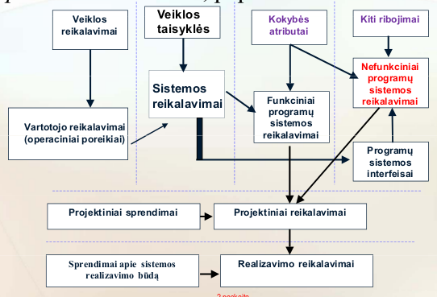
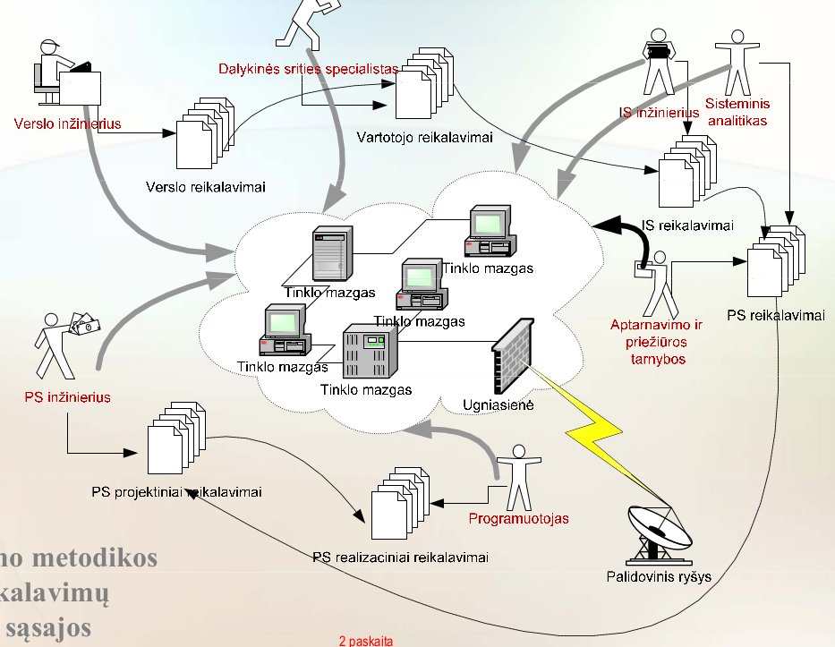
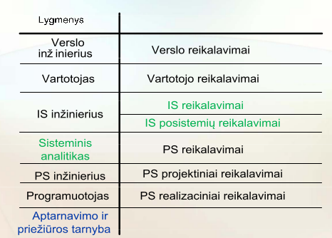

# Reikalavimų Inžinerija. <small>Olegas Vasilecas</small>
## Turinys
1. [Reikalavimai. Savybės. Rūšys](#ch1)
2. [Funkciniai reikalavimai](#ch2)
3. [Nefunkciniai reikalavimai](#ch3)
    1. [Interfeiso](#ch3-1)
    2. [Veikimo](#ch3-2)
    3. [Ekonominiai](#ch3-3)
    4. [Politiniai](#ch3-4)
    5. [Teisiniai](#ch3-5)
4. [Nefunkcinių reikalavimų patikrinimas (**QUINT**)](#ch4)
5. [Anotuoti reikalavimai](#ch5)
6. [Reikalavimų specifikacija](#ch6)
7. [Technologinis Reikalavimų Inžinerijos procesas](#ch7)
8. [Sistemos reikalavimų formulavimas](#ch8)
9. [Reikalavimų lygmenys](#ch9)
10. [Zachmano metodika](#ch10)

## 1. Reikalavimai. Savybės. Rūšys.

- **Reikalavimas** - sandoriu su užsakovu, specifikacija, standartu arba kokiu nors kitu juridinę galią turinčiu dokumentu numatyta tos sistemos savybė.
- Reikalavimai gali būti *skirtingo abstrakcijos lygmens*, nes jų paskirtis dviguba:
  1. Jie naudojami skelbiant konkursą sistemai sukurti ir todėl turi būti pakankamai bendro pobūdžio, kad konkurse galėtų dalyvauti kuo daugiau pretendentų;
  2. Jie yra pagrindinė sandorio tarp užsakovo ir vykdytojo dalis ir todėl turi būti suformuluoti kuo tiksliau ir išsamiau;
- **Reikalavimų specifikacija** - dokumentas, aprašantis ką turi daryti sistema ir kokius kitus reikalavimus ji turi tenkinti.
- **Reikalavimų nustatymas** - procesas, kuriuo nustatoma, kokias paslaugas privalo teikti sistema ir kokius ribojimus ta sistema turi tenkinti teikdama tas paslaugas.

- **Reikalavimų rūšys:**
  - **Vartotojo (operaciniai) poreikiai** turi taip aprašyti reikalavimus, kad jie būtų suprantami žmonėms, tik paviršutiniškai susipažinusiems su tuo, kas yra kompiuteriai ir PS.  
  *(vadovybė, sistemos vartotojai, sistemos architektas)*
  - **Sistemos reikalavimai** - struktūrizuotas detalus sistemos teikiamų paslaugų ir jos tenkinamų ribojimų aprašas.  
  *(sistemos vartotojai, sistemos architektas, PS inžinieriai)*
  - **Projektiniai reikalavimai** - abstraktus PS įgyvendinimo aprašas, naudojamas kaip išeities (output) ribojimai detaliai projektuojant sistemą.  
  *(sistemos architektas, PS inžinieriai)*
- Vartotojo ir sistemos reikalavimai yra **skirtingo detalumo lygmens**, nes juos skaito skirtingi skaitytojai ir jie naudojami skirtingiems tikslams:
  - Vartotojų reikalavimų skaitytojams nesvarbu kaip sistema bus įgyvendinta.
  - Sistemos reikalavimų skaitytojams svarbu tiksliai žinoti ką sistema turi daryti, nes jie turi juos įgyvendinti.
- **Reikalavimų formulavimas** - procesas, kuriuo operaciniai poreikiai yra pertvarkomi į tikslų ir išsamų aprašą, ką sistema darys ir kaip ji veiks.

- **Gerai suformuluotas reikalavimas** turi būti:
  - **Abstraktus** - specifikuoja operacinę (stebimą iš išorės) sistemos savybę ir nieko nekalba apie tai, kaip tą savybę realizuoti sistemoje.
  - **Išsamus** - turi prasmę ne tik tuomet, kai yra nagrinėjamas kartu su kitais reikalavimais, bet ir tuomet, kai jis nagrinėjamas atskirai.
  - **Tikslus** - visi jame vartojami terminai turi griežtai apibrėžtas reikšmes (negalima vartoti griežtai neapibrėžtų terminų).
  - **Vienareikšmis** - jo negalima interpretuoti (suprasti) keliais skirtingais būdais.
  - **Verifikuojamas** - yra žinomas ir prieinamas baigtinis ir kainos bei kitais požiūriais priimtinas procesas (testavimas, stebėjimas, analizė ar kt.), kurį taikant galima nustatyti, ar reikalavimas tikrai yra įgyvendintas.
  - **Įgyvendinamas** - *yra žinomas ir prieinamas* toks ekonominiu, juridiniu bei kitais požiūriais priimtinas *technologinis procesas*, kurio inovaciniai slenksčiai gali būti pašalinti per priimtiną laikotarpį ir už priimtiną kainą ir *kurį taikant galima sukurti sistemą*, turinčią tuo reikalavimu specifikuojamą savybę.
  - **Integruojamas** - sujungus jį su kitais reikalavimais, yra gaunamas tarpusavyje suderintų reikalavimų rinkinys.
  - **Lokalizuojamas** - jį galima susieti su vienu ar keliais konkrečiais kuriamos sistemos komponentais, įgyvendinančiais tą reikalavimą.
  - **Trasuojamas** - yra vienareikšmiškai įvardinamas (pvz., turi unikalų numerį) ir turi nuorodą į savo šaltinį.
  - **Unikalus** - jame nėra kartojama kituose reikalavimuose pateikta informacija.
  - **Glaustas** - jame nėra pagrindimo, apibrėžčių ar kitų nebūtinų dalykų.
  - **Suprantamas** - jis parašytas nevartojant tik specialistams suprantamų terminų ir yra aiškiai pasakyta, kokią funkcinę ar nefunkcinę savybę privalo turėti sistema.

- **Funkciniai reikalavimai** - reikalavimai, nusakantys, kokias paslaugas privalo teikti sistema, kokia turi būti jos reakcija į konkrečius stimulus ir kaip ji turi elgtis konkrečiose situacijose. Paslaugų pobūdis priklauso nuo
  - kuriamos programinės įrangos pobūdžio;
  - tos įrangos vartotojų pobūdžio.
- *Vartotojo lygmens* funkciniai reikalavimai gali gana bendrai aprašyti, ką turi daryti sistema, bet *sistemos lygmens* funkciniai reikalavimai visas sistemos funkcijas (jos teikiamas paslaugas) privalo specifikuoti labai detaliai.
- *Vartotojo lygmens* funkciniai reikalavimai:
  - Kokias **įeigas** sistema gebės apdoroti
  - Kokius **rezultatus** sistema turi generuoti
  - Kokiais **duomenimis** sistema turi operuoti
  - Kokius **skaičiavimus** sistema turi atlikti
- Funkciniai reikalavimai aprašo:
  - pagrindinį (probleminį) sistemos funkcionalumą;
  - pagalbinį funkcionalumą; (funkcionalumą, kurio reikia sistemai aptarnauti, prižiūrėti, administruoti arba darbui su ja palengvinti.)
- Funkciniai reikalavimai gaunami iš:
  - Operacinių poreikių
  - Užduočių
  - Sistemos naudojimo
- Funkcinis reikalavimas aprašo
  - funkcijos **įeigą** (pradinius duomenis);
  - funkcijos **išeigą** (rezultatą);
  - principinį **algoritmą** (jei to reikia).  scenarijaus
- Programų sistema vadinama **korektiška**, jei ji tenkina operacinius vartotojų poreikius ir funkcinės savybės atitinka reikalavimų specifikacija numatytus (funkcinius) reikalavimus.
- **Nefunkciniai reikalavimai** - ribojimai potencialiai galimų projektinių sprendimų aibei. Jie aprašo:
  - interfeiso ribojimus;
  - veikimo ribojimus;
  - ekonominius ribojimus;
  - politinius ribojimus;
  - teisinius ribojimus.

## 2. Funkciniai Reikalavimai

- **Reikalavimai**, nusakantys, kokias paslaugas privalo teikti sistema, kokia turi būti jos reakcija į konkrečius stimulus ir kaip ji turi elgtis konkrečiose situacijose.
- Gaunami iš:
  - Operacinių poreikių
  - Užduočių
  - Sistemos Naudojimo Scenarijaus
- Aprašo:
  - Įeigą
  - Išeigą
  - Algoritmą
- PS funkcinių reikalavimų atžvilgiu yra **korektiška** jei tenkina operacinius vartotojų poreikius ir funkcinės savybės atitinka reikalavimų specifikacija numatytus reikalavimus.

## 3. Nefunkciniai Reikalavimai

- **Ribojimai** potencialiai galimų projektinių sprendimų aibei.
- Nefunkciniai reikalavimai aprašo:
  - interfeiso ribojimus;
  - veikimo ribojimus;
  - ekonominius ribojimus;
  - politinius ribojimus;
  - teisinius ribojimus.

### Interfeiso Ribojimai

- Interfeiso ribojimai riboja sistemos ir jos aplinkos sąveikos būdus.
- Programų sistemos aplinką sudaro:
  - vartotojai;
  - kitos dalykinės programų sistemos;
  - operacinė sistema;
  - duomenų bazės;
  - kompiuterių tinklas;
  - programavimo kalbos;
  - dokumentai.
- Interfeiso reikalavimai atsako į klausimus
  - Kaip turi atrodyti vartotojo interfeisai?
  - Kaip programų sistemos interfeisai turi susieti tą sistemą su jos aplinkos elementais?  
- **Vartotojo interfeiso Reikalavimai:**
  - užduočių formulavimo kalbos (**UFK**) reikalavimai;
    - Kalbos semantinė galia. (abstrakcijos lygmuo)
    - Kalbos procedūriškumas. (procedūrinė | deklaratyvioji | funkcinė | objektinė)
    - Kalbos dalykinė orientacija. (Metaforizavimo principas: Naujas pažinimo struktūras žmonės kuria metaforizuodami esamas (jau išstudijuotas) pažinimo struktūras.)
    - Kalbos selektyvinė geba. (nusako kokiu tikslumu galima filtruoti įvesties ir išvesties duomenis)
    - Kalbos raiškos galia (išsamumas)
    - Sintaksė
    - Užduoties Pateikties Protokolas (UPP) (aprašo, kokiais pranešimais, pateikdamas užduotį, vartotojas keičiasi su sistema etc.)
  - naudojimo paprastumo (**easy-to-use**) reikalavimai;
    - *Vidinė darna*: komandų formato standartas, klavišų naudojimo nepriklausomybė nuo konteksto, pranešimuose vartojamų terminų darna, manipuliavimo ekranu operacijų standartas ir t.t..
    - *Išorinė darna*:  atitikimas išoriniams standartams (pvz., GUI standartams).
    - *Akivaizdumas*: interfeisas suprojektuotas metaforos terminais.
    - *Informatyvumas*: informuoja apie padarytų klaidų pobūdį, aiškina kaip elgtis ir pan.
    - *Prasmingumas*: visi sistemos pranešimai yra glausti, informatyvūs ir formuluojami metaforos terminais.
  - patogumo vartotojui (**user-friend*less***) reikalavimai;
    - Informavimo priemonių tinkamumas (*helpfulness*): ką reikia įtraukti į informavimo (help) failus ir kaip tie failai turi būti organizuoti.
    - *Patrauklumas*: spalvos ir kiti dizaino ypatumą.
    - *Individualizavimas*: kaip vartotojas gali individualizuoti (prisitaikyti savo pomėgiams) interfeisą.
  - **ergonominiai** reikalavimai. (kaip atsižvelgti į potencialių vartotojų psichofiziologines charakteristikas  (pvz., aklus vartotojus). )

### Veikimo ribojimai

  - *tikslumo reikalavimai*: (Verslo taisyklės reglamentuoja duomenų tikslumą ir išsamumą.)
    - Duomenų vaizdavimo tikslumas
    - Skaičiavimų tikslumas
  - *patikimumo reikalavimai* (Patikimumas - PS trykių neigiamo poveikio vartotojų verslo tikslams dydis.)
  - *gyvybingumo reikalavimai* (Kokiu mastu sistema gebės vykdyti kritines (gyvybines) funkcijas trykiams pažeidus kitas jos dalis.)
  - *robastiškumo reikalavimai* (Nusako, kokiu mastu sistema geba išvengti trykių pateikus jai neteisingus duomenis arba ja neteisingai naudojantis. Tai sistemos “nenumušamumo” matas. )
  - *našumo reikalavimai*:
    - reakcijos laikas (response time);
    - pralaidumas (throughput);
    - produktyvumas (efficiency);
    - gaišties laikas (latency);
    - masto keitimas (scalability).

### Ekonominiai Ribojimai

- Ekonominiai ribojimai formuluojami siekiant sumažinti ilgalaikes išlaidas sistemai.
  - **Diegiamumo reikalavimai**:
    - Instaliuojamumas *(ruošinio patikimumas, instaliavimo trukmė, instaliavimo procedūros, parametrizavimas, konfigūravimo galimybės, resursų poreikis (instaliavimui).*
    - Įsisavinamumas *(Matas: tikimybė, kad per laiką  [t1,t2] atitinkamą išsilavinimą turintis asmuo sugebės išmokti dirbti su sistema ar ją administruoti.)*
    - Pastangos duomenų bazėms sukurti
    - Išmokstamumas:
      - Programų sistema yra **koncepciškai skaidri**, jei ji *turi darnų*, akivaizdų, informatyvų ir prasmingą *vartotojo interfeisą; yra komunikatyvi*
      - Programų sistema vadinama **virtualia**, jei ji nuo vartotojo slepia kompiuterinę platformą.
  - **Aptarnaujamumo reikalavimai:**
    - Vartotojų (įskaitant sistemą administruojantį personalą) pastangos, kurių prireikia naudojant sistemą savo užduotims vykdyti.
  - **Prižiūrimumo reikalavimai:**
    - Nuo jų priklauso sistemos darnos palaikymo ir jos perdarymų išlaidos.
    - Prižiūrimumas priklauso nuo:
      - Taisomumo: Kiek pastangų reikia klaidoms pašalinti?
      - Keičiamumo: Kiek pastangų reikia sistemai pritaikyti prie jos reikalavimų pokyčių?
      - Plečiamumo: Kiek pastangų reikia sistemos komponentams pakeisti ir jos funkcionalumui išplėsti?
      - Perkeliamumo: Kiek pastangų reikia sistemai į kitą platformą perkelti?
      - Komponuojamumo: Kiek pastangų reikia sistemos sąveikai su kitomis sistemomis organizuoti?
      - Testuojamumo: Kiek pastangų reikia testams sistemos savybėms patikrinti suprojektuoti ir sukurti?
  - **Tiražuojamumi reikalavimai:**
    - **Portability**: How easy is it to adapt the software to run on different platforms

### Politiniai ribojimai

- **Apsaugos (security)** reikalavimai. Apibrėžia, kokiu mastu sistema turi būti apsaugota nuo galimybių ja pasinaudoti neteisėtai.

### Teisiniai ribojimai

- Teisiniai ribojimai reglamentuoja kas leidžiama ir kas neleidžiama daryti kuriamoje PS, atsižvelgiant į galiojančius teisės aktus

## 4. Nefunkcinių reikalavimų patikrinimas

- **Quint** – tai plačiai naudojamas PĮ kokybės standarto **ISO 9126** plėtinys. Quint pateikia sąvokų sistemą, vartojant kurią PS užsakovai, vartotojai ir tą sistemą kuriantys PS inžinieriai gali diskutuoti apie PS kokybę ir susitarti apie konkrečių kokybės atributų prioritetus.
- **Funkcionalumas:** *(kokiu mastu sistemos funkcijos tenkina užsakovo (vartotojų) poreikius ir ar tos funkcijos turi pageidaujamas savybes.)*
  - Tinkamumas (suitability)
  - Tikslumas (accuracy)
  - Sąveikos (interoperability)
  - Darnumas (compliance)
  - Apsauga (security)
  - Trasuojamumas (traceability)
- **Patikimumas:**
  - Išbaigtumas (maturity)
  - Atsparumas trykiams (fault tolerance)
  - Atkuriamumas (recoverability)
  - Prieinamumas (availability)
  - Pažeidžiamumas (degradability)
- **Perkeliamumas:**
  - Adaptuojamumas (adaptability) *nedarant pakeitimu*
  - Instaliuojamumas (installability)
  - Atitikimas standartams (conformance) *perkeliamumo standartai*
  - Pakeičiamumas (replaceability)
- **Panaudojamumas:**
  - Suprantamums
  - Išmokstamumas
  - Eksploatuojamumas
  - Būsenos vizualizavimas
  - Individualizuojamumas
  - Patrauklumas
  - Aiškumas
  - Informatyvumas
  - Patogumas vartotojui
- **Našumas:**
  - Našumas pagal laiką
  - Našumas pagal resursus
- **Prižiūrimumas:**
  - Analizuojamumas
  - Keičiamumas
  - Stabilumas
  - Testuojamumas
  - Valdomumas
  - Tiražuojamumas

## 5. Anotuoti Reikalavimai

- Reikalavimai anotuojami norint pateikti sistemą kuriančiai organizacijai tam tikras rekomendacijas.
- **[Nr].[statusas][galiojimas][kritiskumas]**
- **Statusas**
  - E - esminis (essential) - *Neįgyvendinus negali būti patenkinami operaciniai poreikiai*
  - D - pageidaujamas (desirable) - *Iš principo, be jų galima ir apsieiti*
  - O - papildomas (optional) - *Paprastai įgyvendinami už papildomą mokestį*
- **Galiojimo laikas**
  - S - pastovus (stable) - *Reikalavimas niekad nekeičiamas*
  - U - nepastovus (unstable) - *Keitimo tikėtinumas nelygus nuliui*
  - T - laikinas (temporary) - *Galimybė lengvai keisti svarbesnė*
- **Kritiškumo laipsnis** *Reikalavimo pažeidimo pasekmės*
  - S - sunkios pasekmės
  - A - apysunkės pasekmės
  - L - lengvos pasekmės

## 6. Reikalavimų specifikacija

- **Reikalavimų specifikacija** - tai oficialus, juridinę galią turintis dokumentas, nustatantis, kokį produktą privalo sukurti vykdytojas.
- Reikalavimų specifikacija reikalinga:
  - Užsakovui:
    - Konkursui organizuoti
    - Baigtai sistemai vertinti
  - Projekto vadovui:
    - Projektui planuoti
  - Projektuotojui:
    - Sistemai projektuoti
  - Testuotojui:
    - Testams specifikuoti
- ### Gerai parašytos reikalavimų specifikacijos savybės:
  - Tenkina projektuotojų poreikius
  - Reikalavimai numeruoti
  - **Konceptualumas** (appropriateness): reikalavimų specifikacija yra konceptuali, jei visi joje pateikti reikalavimai yra abstraktūs, t.y. joje nėra liečiami sistemos projektavimo ar įgyvendinimo klausimai.
  - **Koncepcinė skaidra**: apima specifikacijos paprastumą, aiškumą ir suprantamumą.
  - **Konkretumas** (constructability): specifikacija yra konkreti, jei gali būti patikrintas visų joje suformuluotų reikalavimų įgyvendinimo laipsnis.
  - **Geras struktūrizavimas**: joje griežtai išlaikytas turinių atskyrimo principas.
  - **Tikslumas**: visi joje suformuluoti reikalavimai yra tikslūs.
  - **Išsamumas**: specifikacijoje aprašytas visas reikalingas sistemos funkcionalumas ir visi joje pateikti reikalavimai yra išsamūs.
    - Išsamioje specifikacijoje turi būti aprašyta, kaip sistema reaguoja į kiekvieną iš galimų įvesties tipų kiekvienoje galimoje situacijoje. *Reikia nagrinėti ne tik kaip reaguoja sistema į leistinas (teisingas) įvestis, bet ir kaip ji reaguoja į klaidingas įvestis.*
    - Išsamioje specifikacijoje turi būti visos reikalaujamos to dokumento dalys, visi puslapiai, visi paveikslėliai ir visos lentelės turi būti sunumeruoti, paveikslėliai ir lentelės turi turėti pavadinimus, turi būti pateiktos tvarkingos nuorodos į visus naudojamus išorinius informacijos šaltinius.
    - Kartais analizės metu visų reikalavimų specifikuoti nepavyksta, kai kurių reikalavimų specifikavimą tenka atidėti vėlesniam laikui. Tokie reikalavimai pažymimi žyme **AVL**. Išsamioje specifikacijoje kiekvienam AVL žyme pažymėtam reikalavimui turi būti nurodyta:
      - *kodėl* reikalavimo formulavimas yra atidėtas;
      - *kas turi būti atlikta*, kad reikalavimą būtų galima suformuluoti;
      - *iki kada* reikalavimas turi būti suformuluotas;
      - *kas atsakingas* už tai, kad reikalavimas būtų suformuluotas nurodytu laiku.
  - **Vienareikšmiškumas**: neturi būti jokių dviprasmybių
  - **Trasuojamumas**: reikalavimai yra lokalizuojami ir reikalavimų ir projektinę specifikacijas galima tarpusavyje susieti kryžminėmis nuorodomis.
  - **Darna**: visi joje suformuluoti reikalavimai yra integruojami, jokių prieštaravimų dokumente nėra. *Nedarna gali atsirasti dėl terminų konfilto, savybių konflikto ar naudojimo režimų konflikto*
  - **Keičiamumas**: dokumentas turi būti lengvai keičiamas. *Specifikaciją lengva keisti, jei ji parašyta griežtai prisilaikant turinių atskyrimo principo ir visi reikalavimai turi unikalius numerius.*
  - **Naudojimo patogumas**: mažai kas skaito visą dokumentą, kiekvienam reikia tik to, kas jam svarbu. Todėl dokumentas turi būti parašytas taip, kad juo būtų galima naudotis kaip žinynu.
  - Reikalavimų specifikacija pateikiama varžovams besivaržantiems konkurse dėl projekto. *Tinkamai organizuotas konkursas padeda užsakovui pasirinkti vykdytoją, kuris reikalavimus įgyvendins pigiausiai.*
  - Kad konkurse galėtų dalyvauti kuo daugiau pretendentų, reikalavimai turi būti suformuluoti kuo bendriau. *Kita vertus, reikalavimai turi būti pakankamai konkretūs, kad konkurse negalėtų dalyvauti pretendentai, siūlantys sukurti ne tai, ko iš tiesų reikia užsakovui. Idealiu atveju, reikalavimai turėtų būti suformuluoti taip, kad visi galimi pasiūlymai būtų suskirstyti į dvi dalis: tuos, kurie tenkina vartotojų poreikius, ir tuos, kurie tų poreikių netenkina.*

## 7. Technologinis Reikalavimų Inžinerijos procesas:

1. Poreikių analizė
2. Aiškinimasis ir analizė **PROTOTIPAI**
3. Specifikavimas
4. Vertinimas **PROTOTIPAI**
5. Dokumentavimas

## 8. Sistemos reikalavimų formulavimas

1. Suformuluojami verslo (**veiklos**) reikalavimai. *Kadangi yra siekiama patobulinti ar išplėtoti kokią nors veiklą, tai visų pirma reikia suformuluoti, kokius tos veiklos aspektus norima tobulinti ar plėtoti.*
2. Suformulavus veiklos reikalavimus reikia išsiaiškinti, kokių informacinių, skaičiavimo ar komunikacinių paslaugų prireiks tiems reikalavimams įgyvendinti. Šie **Operaciniai Poreikiai** dar vadinami vartotojo reikalavimais.
3. Išsiaiškinus operacinius poreikius reikia suformuluoti tuos poreikius tenkinančios veiklai palaikyti skirtos **sistemos** reikalavimus.*Formuluojant veiklą palaikančios sistemos reikalavimus, nusprendžiama, kaip bus dirbama po to, kai planuojama sistema bus sukurta ir įdiegta.* Sistemos reikalavimai reglamentuojami **verslo taisyklėmis**.
4. Vadovaujantis veiklą palaikančios sistemos reikalavimais pradedami formuluoti programų sistemos reikalavimai
5. Programų sistemos reikalavimai baigiami formuluoti pridedant nefunkcinius reikalavimus, gaunamus atsižvelgiant į *siekiamų kokybės tikslų prioritetus* bei kitus, papildomus reikalavimus.
6. Naudojant reikalavimų nuleidimo žemyn technikas programų sistemos reikalavimai yra transformuojami į **projektavimo**, o po to ir į **realizavimo** reikalavimus.

## 9. Reikalavimų lygmenys

- **Zachmano metodika** numato 6 reikalavimų formulavimo lygmenis, aprašančius skirtingų projekto dalyvių požiūrius į kuriamąją programų sistemą:
  1. verslo inžinieriaus arba verslo konsultanto,
  2. dalykinės srities specialisto (vartotojo),
  3. informacinių sistemų inžinieriaus,
  4. programų sistemų inžinieriaus,
  5. programuotojo,
  6. veikiančias sistemas aptarnaujančių bei prižiūrinčių tarnybų.

## 10. Zachmano metodika

- Zachmano metodika, dar vadinama Zachmano metodiniu karkasu, nusako išsamų sistemos kūrimo proceso produktų sąrašą (taikant nustatytą požiūrių taškų rinkinį) ir jų aprašus.
- Aprašoma lentele, kurios eilutės atitinka reikalavimų lygmenis, o stulpeliai - klausimus `Kodėl?` `Kaip?` `Ką?` `Kas?` `Kur?` `Kada?`

lygmenys | Kodėl? | Kaip? | Ką? | Kas? | Kur? | Kada?
---------|--------|-------|-----|------|------|-------
Verslo inžinierius  ||||||
Vartotojas          ||||||
IS inžinierius      ||||||
PS inžinierius      ||||||
Programuotojas      ||||||
Aptarnavimo ir priežiūros tarnyba ||||||

1. Verslo reikalavimai nusako **strateginius verslo tikslus**. Tai aukščiausio lygio reikalavimai, nes PS ir yra kuriama tam, kad padėtų įgyvendinti verslo tikslus.
2. Dalykinės srities specialistų požiūrį aprašo **vartotojo reikalavimai**.
3. IS inžinieriaus požiūrį aprašo **IS reikalavimai**, gaunami detalizuojant ir konkretizuojant vartotojo reikalavimus.
  - Informacinių sistemų inžinieriaus požiūrį detalizuoja informacinės sistemos posistemių reikalavimai
4. Tarp trečiojo ir ketvirtojo originalios Zachmano metodikos lygmenų tenka įvesti papildomą lygmenį, aprašantį **sisteminio analitiko** požiūrį. *Kuriant mažoms organizacijoms skirtas paprastas programų sistemas, reikalavimų formulavimas gali būti pradėtas nuo šio lygmens.*
5. PS inžinieriaus požiūrį aprašo **projektiniai PS reikalavimai**. *Šiame lygmenyje priimami sprendimai, kokia infrastruktūra (kompiuterinė platforma, DBVS tipas ir kt.) bus naudojama programų sistemai kurti, parenkama tos sistemos architektūra ir, remiantis tos sistemos reikalavimais, suformuluojami jos komponentų reikalavimai.*
6. Programuotojo požiūrį aprašo **realizaciniai PS reikalavimai**, nusakantys, kokiomis programavimo kalbomis kalbomis, kokiais kompiliatoriais, kokia tarpine programine įranga ir kokiomis kitomis konkrečiomis instrumentinėmis priemonėmis gali naudotis programuotojai, kurdami šią programų sistemą.

- ### Stulpeliai:
  1. `Kodėl?`: Viršutinėje lentelės eilutėje čia pateikiama motyvacija, kodėl norima tobulinti verslą. Leidžiantis eilutė po eilutės šiuo stulpeliu lentele žemyn, yra nusileidžiama iki reikalavimų, kokia turi būti šią viziją padedanti įgyvendinti programų sistema.
  2. `Kaip?` pasiekti pirmame stulpelyje suformuotus tikslus?:
    1. Kokias paslaugas turėtų teikti patobulintą verslo sistemą palaikanti informacinė sistema.
    2. Kokie yra būsimųjų vartotojų operaciniai poreikiai, t.y., kokias verslo užduotis (taip pat ir verslo transakcijas) jie vykdys
    3. Kokias užduotis turi vykdyti tas verslo transakcijas palaikanti IS ir kiek patikimi turi būti tų užduočių vykdymo rezultatai
    4. Kokius posistemius privalo turėti tokia IS ir kokias užduotis privalo vykdyti tie posistemiai,
    5. Koks turi būti tuos IS posistemius palaikančių PS funkcionalumas ir kiek patikimi turi būti jų rezultatai
    6. Kokie turi būti kiekvieno iš tą PS sudarančių komponentų funkcionalumas bei patikimumas
    7. Kokiomis priemonėmis tie komponentai turi būti kuriami ir kokiu mastu turi būti testuojamas kiekvienas iš jų
  3. `Ką?` turi apdoroti antrajame stulpelyje numatytos procedūros, tiksliau, kokius reikalavimus turi tenkinti tomis procedūromis apdorojami objektai?
  4. `Kas?` naudosis programų sistemos teikiamomis paslaugomis ir kokius įgaliojimus jie turi?
  5. `Kur?`, t.y., kokiose darbo vietose dirbs dalykinės srities specialistai?
  6. `Kada?`: Stulpelis yra skirtas verslo užduočių, IS, PS ir jos komponentų našumo reikalavimams formuluoti.

- ### Sistemos rinkai
  - Kuriant sistemas rinkai, atlikus rinkos analizę, galima išsiaiškinti potencialių pirkėjų tipines problemas ir pasiūlyti priemonę toms problemoms spręsti.
  - Rinkai kuriamoms sistemoms, išskyrus vadinamuosius ERP ir kitus panašius paketus, apskritai dingsta eilutė, aprašanti informacinių sistemų inžinieriaus požiūrį. Taip yra todėl, kad paprastai nėra žinoma, kokiame konkrečiame kontekste bus naudojamas kuriamasis produktas.

lygmenys | Kodėl? | Kaip? | Ką? | Kas? | Kur? | Kada?
  --- | --- | --- | --- | --- | --- | ---
  Verslo r. | Rinkos analizė | Produkto teikiamos paslaugos | Realaus pasaulio objektai | Vartotojų grupių nustatymas | Darbo vietų nustatymas | Produkto galimybių našumas
  Vartotoj.| Vykdomos užduotys | Informacinės, skaičiavimo ir kitos paslaugos | Informacinių objektų konceptai | Kvalifikaciniai vartotojo reikalavimai | Bendrieji darbo vietų reikalavimai | Užduočių vykdymo našumas
  PS r.    | Ekonominiai, politiniai ir teisiniai ribojimai, kokybės vertinimo kriterijai | Funkciniai, saugos, patikimumo, diegimo, aptarnavimo ir priežiūros r. | Duomenų reikalavimai | Vartotojo interfeisų r. | Tech Specs requiremets | Produkto našumas
  Projek.PS| Eskizinio lygmens PS architektūros reikalavimai | Funkciniai, saugos, robastiškumo, patikimumo, diegimo, aptarnavimo, priežiūros r. | Loginio lygmens DB ir t.t. | Komponentų interfeisų r. | Komponentų išdestymas tinkle | Komponentų našumas
  Program. | Detali PS architektūra | Realizavimo ir testavimo r. | Fizinio lygmens DB ir t.t. reikalavimai | Procedūrų, klasių, etc. r. | Tinklo komponentų sąveika | Algoritmų efektyvumas
