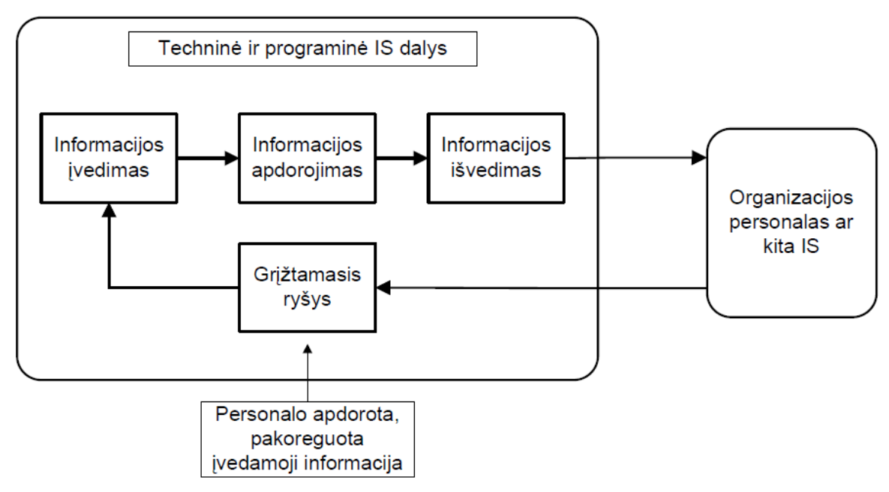

# Duomenų Bazės. <small>Jelena Stankevič</small>
## Turinys
1. [Pagrindinės sąvokos](#ch1)
  - [DB raida](#ch1-1)
  - [DBVS](#ch1-2)
2. [SQL Kalba](#ch2)
  - [Sintaksė](ch2-1)
3. [Reliacinė algebra](#ch3)
4. [DB sistemos gyvavimo ciklas. Koncepcinis modelis](#ch4)
5. [Normalizacija](#ch5)
6. [DB Apsauga](#ch6)
7. [Indeksai ir Rodiniai](#ch7)

## 1. Pagrindinės sąvokos
<a name="ch1"></a>
- **Informacinė Sistema** - tarpusavyje susiję metodai, priemonės ir personalas, naudojami informacijai saugoti, apdorot ir teikti, siekiant tam tikro tikslo. *Bet kurios IS tikslas yra duomenų apie realius pasaulio objektus apdorojimas*
- **IS komponentai**:
  - Techninė įranga:
    - Kompiuteriai
    - Kompiuterių tinklai
  - Programinė įranga:
    - Sisteminė PĮ
    - Taikomoji PĮ
  - Duomenys
  - Personalas



- **Duomenys** - saugomi, bet nenaudojami požymiai, stebėjimai
- **Informacija** - naudojami prasminiai bei susieti duomenys


- **Duomenų bazė** - duomenų apie konkrečius objektus tam tikroje dalykinėje srityje visuma
- *Kompiuterizuota DB* - rinkinys logiškai tarpusavyje susijusių duomenų vienetų, kurie gali būti apdorojami viena ar keliomis taikomosiomis programomis (ar programų sistemomis), siekiant patenkinti organizacijos informacinius poreikius
- DB pateikia tam tikrą realaus pasaulio aspektą, vadinamą mini-pasauliu.


- **Informacinis objektas:**
  - **Atributas** - logiškai nedalomas informacinis elementas, aprašantis tam tikrą objekto, proceso ar reiškinio savybę.
  - Duomenų tipai:
    - Baziniai:
      - Sveikieji skaičiai (**integer**). Galimos `+ - * / div mod` operacijos, turi max ir min.
      - Realieji skaičiai (**float**). Galimos `+ - * /` operacijos. Skaičiuojama tam tikru tikslumu.
      - Simboliai (**char**). Galima palyginti pagal kodą
      - Eilutės (**string**). Galima palyginti, sudėti, ištraukti fragmentą. *Atskirais atvejais priskiriama prie struktūrinių*
      - Loginiai Duomenys (**boolean**). Loginės opracijos `& || !`
      - Data ir laikas (**date**). Trukmė
      - Laiko momentas (**timestamp**).

### DB Raida
<a name="ch1-1"></a>
- **Duomenų apdorojimo sistema** - automatizuota organizacijos dokumentuose esančių duomenų sistema.
- **Failinės duomenų sistemos** buvo naudojamos iki ~1960m. Pagrindiniai trūkumai:
  - Duomenų perteklumas
  - Silpna duomenų kontrolė
  - Nepakankamos valdymo galimybės
  - Didelės sąnaudos programuojant
  - Failų formatų nesuderinamumas

### DBVS
<a name="ch1-2"></a>
- **Duomenų bazių valdymo sistema** - programinių priemonių kompleksas, leidžiantis:
  - Aprašyti duomenų struktūras
  - Įvesti duomenis
  - Atlikti paiešką
  - Sudaryti ataskaitas
- Taip pat pasiekiamos galimybės:
  - Duomenų vientisumo palaikymas
  - Duomenų neprieštaringumo kontrolė
  - Duomenų apsauga
  - Kelių naudotojų palaikymas
  - Būsenos po avarijos atstatymas
- Trūkumai:
  - Dideli poreikiai techniniams ištekliams
  - Didelė diegimo kaina
  - Menkas pavienių užduočių sprendimo našumas
  - Centralizacija (sugedus vienam - nebeveikia niekas)
- **Duomenų bazės sistema** = DB + DBVS + Naudotojai
- Duomenų ir taikomųjų programų nepriklausomumas pasiekiamas, kai DB pateikia data dictionary, per kurį yra kreipiamasi į duomenis.


- **DB struktūros modeliai:**
  - Hierarchinis. Rodyklės į fizinius įrašų adresus
  - Tinklinis. Tas pats.
  - **Reliacinis** - pagrįstas loginiu duomenų ryšiu.
    - Duomenys talpinami į lenteles, vadinamas *sąryšiais*
    - Galima reliacinė algebra


- DB sistemos atsiradimas pakeitė IS kūrimo paradigmą: dabar pirmiausia aprašoma duomenų struktūra, o tik po to realizuojamas sistemos funkcionalumas

## 2. SQL Kalba
<a name="ch2"></a>
- Sukurta 1970m. IBM tyrimų centre
- **Structured Query Language**. Standartinė DB prieigos kalba
- Operatoriai skirstomi į:
  - **DDL** *Duomenų aprašymo operatoriai*<br>
  `[CREATE | ALTER | DROP] [SCHEMA | TABLE | DOMAIN | VIEW]`
  - **DML** *Duomenų manipuliavimo operatoriai*<br>
  `[SELECT | INSERT | UPDATE | DELETE]`
  - **DCL** *Duomenų prieigos kontrolės operatoriai*<br>
  `[GRANT | REVOKE ] [CREATE [USER | ROLE]]`
  - **TCL** *Transakcijų kontrolės operatoriai*<br>
  `[COMMIT | ROLLBACK]`
- Sąlygos operatoriai:
  - Palyginimo operacijos: `=, <, <=, >, >=, <>`
  - `x BETWEEN y AND z`
  - `x NOT BETWEEN y AND z`
  - `x IN (y1, y2, ..., yn)`
  - `x NOT IN (y1, y2, ..., yn)`
  - `x LIKE y`
  - `x NOT LIKE y`
  - `x IS NULL`
  - `x IS NOT NULL`
  - Bulio išraiškos `AND OR NOT`

- **ORACLE SQL funkcijos:**
  - Agregatinės:<br>
  `SUM(...) AVG(...) COUNT(...) MAX(...) MIN(...)`
  - Skaliarinės:<br>
  `LENGTH(...) SUBSTR(...) TO_CHAR(...) ROUND(...)`
- **Schema** - surištų lentelių, rodinių ir kitų DB objektų grupė. Atvaizduoja pilną DB struktūrą.

### Sintaksė
<a name="ch2-1"></a>
- `SELECT`
```SQL
SELECT [DISTINCT] <stulpelio vardas> [AS Naujas_Vardas] , ...
	FROM <lenteles vardas> [Len_Naujas_Vardas] , ...
	[WHERE <paieškos sąlyga>]
	[GROUP BY <stulpelių vardai> [HAVING <paieškos sąlyga>]]
	[ORDER BY <stulpelių vardai> [DESC]];```
- `INSERT`
```SQL
INSERT INTO <lentelės_vardas> [(<stulpelio vardas>{, stulpelio vardas>})]
    VALUES (<reikšmė>{,<reikšmė>}) |NULL |DEFAULT;
```
- `DELETE`
```SQL
DELETE FROM <lentelės_vardas> [WHERE <paieškos sąlyga>];
```
- `UPDATE`
```SQL
UPDATE <lenteles_vardas> SET <stulpelio_vardas> = <reiškinys>
    {, <stulpelio_vardas> = <reiškinys>} [WHERE <paieškos sąlyga>];
    ```
- `ALTER`
```SQL
ALTER TABLE Employes ADD COLUMN pager_num CHAR (12);
ALTER TABLE Employees MODIFY COLUMN pager_num SET DEFAULT ‘714-555-1234’;
ALTER TABLE Employees MODIFY COLUMN pager_num DROP DEFAULT;
```
- `DOMAIN`
```SQL
CREATE DOMAIN loc_no AS INTEGER;
ALTER DOMAIN employee_num ADD check_range CHECK (VALUE BETWEEN 1 and 10000);
DROP DOMAIN loc_no;
```
- `DROP TABLE`
```SQL
DROP TABLE Employees RESTRICT; /*Neleidzia salinti, jei yra susijusiu obj*/
DROP VIEW emp_view_1003 CASCADE; /*Pasalina visus susijusius obj*/
```
- **Data Control Language**
```SQL
GRANT <veiksmas> ON <objektas> TO <naudotojas>;
REVOKE <veiksmas> ON <objektas> FROM <naudotojas>;
```

## 3. Reliacinė Algebra
<a name="ch3"></a>
- Tai teorinė kalba, skirta darbui su vienu arba keliais sąryšiais.
- Reliacinės algebros taikymo rezultatas – naujas sąryšis.
- Sukurta E.F.Codd’o 1972 metais.


- **Operacijos:**
  - Išrinkimas (**Selection**) *Išrenka eilutes, atitinkančias sąlygą*<br>
  `SELECT * FROM relation WHERE condition;`
  > σ<sub>condition</sub>(relation)

  - Projekcija (**Projection**) *Išrenka tik nurodytus stulpelius*<br>
  `SELECT attr1, attr2, attr3 FROM relation;`
  > π<sub>list of attributes</sub>(relation)

  - Dekarto sandauga (**Cartesian product**) *Aibė visų įmanomų eilučių porų*<br>
  `SELECT Employee.*, Customer.* FROM Employee, Customer;`
  > R x S

  - Sąjunga (**Union**) *Sujungia visas eilutes į vieną sąryšį, pašalinant dublikatus.*<br>
  `SELECT * FROM Employee1 UNION SELECT * FROM Employee2;`
  > R υ S

  - Skirtumas (**Difference**) *Sudaro sąryšį iš eilučių, kurios yra pirmame sąryšyje ir kurių nėra antrame.*<br>
  `SELECT * FROM Employee1 EXCEPT SELECT * FROM Employee2;`
  > R - S

  - Sankirta (**Intersection**) *Sukuriamas naujas sąryšis iš bendrų pirmo ir antro sąryšio eilučių.*<br>
  `SELECT * FROM Employee1 INTERSECT (SELECT * FROM Employee2);`
  > R ⋂ S

  - Jungtis (**Join**) *visos įmanomos poros iš jungiamų sąryšių, tenkinančios tam tikrą sąlygą. Tai - **išvestinė operacija***
    - Theta-join
    > R ⋈<sub>F</sub> S = σ<sub>F</sub> (R x S)

    - Equi-join *⋈, Kai F yra =*
    - Natural join
    > R ⋈ S

    - Outer Join (LEFT | RIGHT) *Disjunkcija*
    - Inner Join *Konjunkcija*

## 4. DB sistemos gyvavimo ciklas. Koncepcinis modelis
<a name="ch4"></a>
- Trijų lygmenų DB architektūroje išskiriami trys
abstrakcijos lygmenys:
  1. Išorinis. *Išorinį lygmenį sudaro atskirų vartotojų grupių įsivaizdavimų apie duomenis, esančius duomenų bazėje, ir santykį tarp duomenų, apibendrinimas.*
  2. Koncepcinis *koncepcinė duomenų schema, gauta konceptualiai modeliuojant duomenis, prieš tai atsižvelgiant į visus vartotojų reikalavimus.*
  3. Vidinis *Vidiniame lygmenyje kalbame apie diskasukius, fizinius adresus, indeksus, rodykles ir pan., apie priemones DBVS paspartinimui. Vartotojai šio lygmens nepasiekia.*
- **DB gyvavimo ciklas** – tai DB projektavimo, realizacijos ir palaikymo procesas. DB gyvavimo ciklas negali būti orientuotas į funkcijas. Svarbu ne tai, ką galima su duomenimis padaryti, svarbu tai, kokių duomenų ir jų struktūrų reikia, kad tai galima būtų padaryti.
- Etapai:
  1. **Išankstinis planavimas**<br>
  Strateginio plano dalis, nusakanti, kokios naujos programos artimiausiu metu turėtų būti kuriamos ir kokių duomenų joms gali prireikti.
  2. **Įgyvendinamumo patikra**
    - Technologinis įgyvendinamumas. Ar egzistuoja planuojamai DB sukurti reikalingos technologijos (aparatūra, programinė įranga)?
    - Operacinės galimybės. Ar turi organizacija specialistų, ekspertų ir kitų išteklių sėkmingam plano įgyvendinimui (ar žmonės moka dirbti su DB, kompiuteriais, ar reikalingi apmokymai)?
    - Ekonominė nauda. Ar atsipirks naujos DB kūrimo sąnaudos ir per kiek laiko (rizika, konkurentabilumas, nauda, tame tarpe ir politinė)?
  3. **Reikalavimų formulavimas**<br>
  Reikia nusakyti DB tikslus ir kiekvieno vartotojo informacinius poreikius.
  4. **Koncepcinis projektavimas**<br>
  Koncepcinio modeliavimo metu iš vartotojų gauta informacija apibendrinama (išorinis DB lygmuo perkeliamas į koncepcinį), šalinami trūkumai, prieštaravimai ir t.t.
  5. **Realizacija**
    1. DBVS pasirinkimas ir įsigijimas (nebūtinai RDBVS)
    2. Koncepcinis modelis paverčiamas fiziniu
    3. Sudaromas duomenų žodynas (sukuriamos struktūros, aprašomos vartotojų teisės ir t.t.)
    4. DB užpildoma eksperimentiniais duomenimis
    5. Taikomųjų programų sukūrimas
    6. Vartotojų apmokymai
  6. **Darbo įvertinimas ir DB palaikymas**<br>
  Po tam tikros trumpos eksploatacijos jau galima įvertinti, ar tenkinami visi poreikiai duomenims ir jų struktūroms, išaiškėja padarytos klaidos.


- **Modelis** – tai realaus pasaulio atspindys, kuriame pavaizduotos tik tam tikros, uždaviniui spręsti reikalingos realaus pasaulio savybės.
- **Atvaizdavimas** – tai vienos srities elementų asocijavimas su kitos srities elementais.
- Pagridiniai DB modeliaimo lygmenys:
  - **Koncepcinis duomenų modelis.** Schemoje nurodomos bendriausios objektų ir jų tarpusavio ryšių savybės. Koncepcinis modelis kuriamas tik atsižvelgiant į reikalavimus duomenims reikalavimų specifikavimo etape. Nepriklauso nuo DBVS tipo.
  - **Loginis duomenų modelis.** Vystomas duomenų modelis, atsižvelgiant į tai, kokio tipo DBVS bus realizuota (hierarchinėje, tinklinėje, reliacinėje ar pan. DBVS). Neatsižvelgiama į konkrečios DBVS ypatybes.
  - **Fizinis duomenų modelis.** Išvystytas loginis duomenų modelis, atsižvelgiant į konkrečios DBVS tipą ir jos savybes (turimi duomenų tipai, transakcijų ar trigerių palaikymas ir pan.)


- Pagrindinis elementas – **esybė**, atspindinti realaus pasaulio objektą, galintį egzistuoti tiek fiziškai, tiek konceptualiai (pvz., firma, užduotis ar pan.).
- **Atributai** aprašo esybės savybes:
  - paprastieji ar sudėtiniai (kompoziciniai)
  - vienareikšmiai ar daugiareikšmiai
  - išvestiniai ir saugomi (pvz., darbo pradžia ir pabaiga (išvestinis trukmė) arba atvirkščiai)
- **Identifikatorius** – tai atributų rinkinys, kurių reikšmės vienareikšmiškai apibrėžia esybės egzempliorių (raktas).
- **Surogatinis raktas** – abstrakčios esybės egzemplioriaus „identifikatorius”, kuris neturi prasmės už kompiuterizuotos sistemos ribų.
- **Ryšio laipsnis** – tai ryšyje dalyvaujančių esybių skaičius.
- **Kardinalumas** nusako, kelis ryšius su kitomis esybėmis gali sudaryti esybė. Išskiriami pagrindiniai ryšio tipai:
  - 1:1 (ryšio pavyzdys yra SKYRIUI vadovauja DARBUOTOJAS)
  - 1:N (SKYRIUJE dirba DARBUOTOJAI)
  - N:M (DARBUOTOJAS vykdo PROJEKTĄ)
- Kai kurios esybės neturi savo raktinių atributų arba turi tik dalį atributų, tinkamų ją identifikuoti. Paprastai tokios esybės **priklauso** kitai esybei (vad. identifikuojantis
savininkas), t.y. abi esybės susietos priklausomybės ryšiu.
- Normaliomis sąlygomis priklausoma esybė turi dalinį raktą. T.y. jei esybei-savininkui priklauso keletas esybių, tai dalinis raktas unikaliai identifikuoja *to paties savininko* esybes.
- Kiti ryšių tipai:
  - **Yra (is a)**
  - **Agregavimo**
  - **Aukštesnio laipsnio** ryšiai

## 5. Normalizacija
<a name="ch5"></a>
- Normalizacija **(lentelių skaidymas)** – tai DB schemos sąryšių skaidymas į smulkesnius sąryšius, siekiant išvengti duomenų atnaujinimo anomalijų ir kitu nepageidaujamų efektų.
  - **1NF** *Sąryšis (lentelė) yra pirmos normalinės formos, jei visų jos atributų reikšmės yra atomai. Kitaip tariant, 1NF draudžia sąryšius sąryšiuose, arba sąryšius vaizduoti daugiareikšmiais vieno kortežo atributais.*<br>
    - **Funkcinė priklausomybė** X→Y.
    - **Determinantas** – tai atributai, kurių reikšmės apibrėžia kitų atributų reikšmes.
    - Tipai:
      - Trivialioji, jei Y yra X poaibis
      - Netrivialioji, jei yra bent vienas Y<sub>i</sub> nepriklausantis X
      - Visiškai netrivialioji, jei nė vienas Y<sub>i</sub> nepriklauso X
  - **2NF** *Sąryšis (lentelė) yra antrosios normalinės formos (2NF), jeigu jis yra 1NF ir kiekvienas jo neraktinis atributas yra pilnoje funkcinėje priklausomybėje nuo bet kokio galimo to sąryšio rakto. T.y. nėra dalinių funkcinių priklausomybių.*
    - Sukuriamas naujas sąryšis, kurio atributai yra pradinio sąryšio atributai, įeinantys į funkcinę priklausomybę tarp neraktinių atributų ir rakto dalies. Determinantas tampa naujo sąryšio raktu;
    - Atributai, esantys dešinėje funkcinės priklausomybės pusėje, pašalinami iš pradinio sąryšio;
    - Jei pradinis sąryšis nėra 2NF dėl daugiau nei vienos funkcinės priklausomybės, tai žingsniai 1 ir 2 kartojami kiekvienai tokiai priklausomybei.
  - **3NF** *Sąryšis (lentelė) yra trečiosios normalinės formos (3NF), jeigu jis yra 2NF ir kiekvienas jo neraktinis atributas yra tiesioginėje pilnoje, bet ne tranzityvioje priklausomybėje nuo bet kokio galimo to sąryšio rakto. T.y. reikia užtikrinti, kad visi neraktiniai atributai būtų vienas nuo kito nepriklausomi.*
  - **Boyce -Codd NF** *Sąryšis R yra BCNF, jei, esant priklausomybei X→A, X yra R superraktas, t.y. kiekvienos netrivialios funkcinės priklausomybės determinantas yra raktas.*
  - **4NF** *Sąryšis L(R) yra 4 normalinės formos (4NF) tada ir tik tada, kai egzistuojant netrivialiai daugiareikšmei priklausomybei A→→B, A ir B yra R poaibiai, visi kiti atributai funkciškai priklauso nuo A.*
    - Sąryšyje R (A, B, C) yra daugiareikšmė priklausomybė A→→B tada ir tik tada, kai atributų B reikšmių aibė, atitinkanti bet kurias atributų aibių A ir C reikšmes, priklauso tik nuo A ir nepriklauso nuo atributų C reikšmių.

## 6. DB Apsauga
<a name="ch6"></a>
- 


## 7. Indeksai Ir Rodiniai
<a name="ch7"></a>


      t
